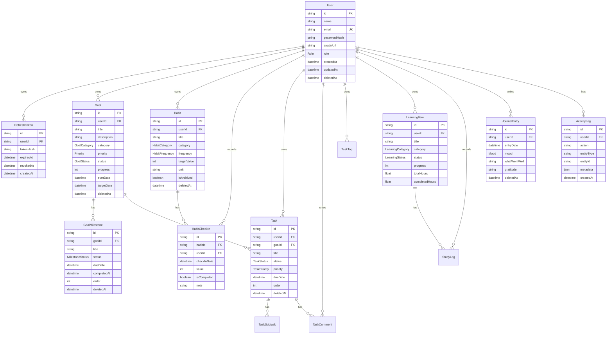

# Entity Relationship Diagram

LifeOS stores user-owned life management data in PostgreSQL through Prisma.

```mermaid
erDiagram
  User ||--o{ RefreshToken : owns
  User ||--o{ Goal : owns
  Goal ||--o{ GoalMilestone : has
  User ||--o{ Habit : owns
  Habit ||--o{ HabitCheckIn : has
  User ||--o{ HabitCheckIn : records
  User ||--o{ Task : owns
  Goal ||--o{ Task : relates
  Task ||--o{ TaskSubtask : has
  Task ||--o{ TaskComment : has
  User ||--o{ TaskComment : writes
  User ||--o{ TaskTag : owns
  User ||--o{ LearningItem : owns
  LearningItem ||--o{ StudyLog : has
  User ||--o{ StudyLog : records
  User ||--o{ JournalEntry : writes
  User ||--o{ ActivityLog : has

  User {
    string id PK
    string name
    string email UK
    string passwordHash
    string avatarUrl
    Role role
    datetime createdAt
    datetime updatedAt
    datetime deletedAt
  }
  RefreshToken {
    string id PK
    string userId FK
    string tokenHash
    datetime expiresAt
    datetime revokedAt
    datetime createdAt
  }
  Goal {
    string id PK
    string userId FK
    string title
    string description
    GoalCategory category
    Priority priority
    GoalStatus status
    int progress
    datetime startDate
    datetime targetDate
    datetime deletedAt
  }
  GoalMilestone {
    string id PK
    string goalId FK
    string title
    MilestoneStatus status
    datetime dueDate
    datetime completedAt
    int order
    datetime deletedAt
  }
  Habit {
    string id PK
    string userId FK
    string title
    HabitCategory category
    HabitFrequency frequency
    int targetValue
    string unit
    boolean isArchived
    datetime deletedAt
  }
  HabitCheckIn {
    string id PK
    string habitId FK
    string userId FK
    datetime checkInDate
    int value
    boolean isCompleted
    string note
  }
  Task {
    string id PK
    string userId FK
    string goalId FK
    string title
    TaskStatus status
    TaskPriority priority
    datetime dueDate
    int order
    datetime deletedAt
  }
  LearningItem {
    string id PK
    string userId FK
    string title
    LearningCategory category
    LearningStatus status
    int progress
    float totalHours
    float completedHours
  }
  JournalEntry {
    string id PK
    string userId FK
    datetime entryDate
    Mood mood
    string whatWentWell
    string gratitude
    datetime deletedAt
  }
  ActivityLog {
    string id PK
    string userId FK
    string action
    string entityType
    string entityId
    json metadata
    datetime createdAt
  }
```
